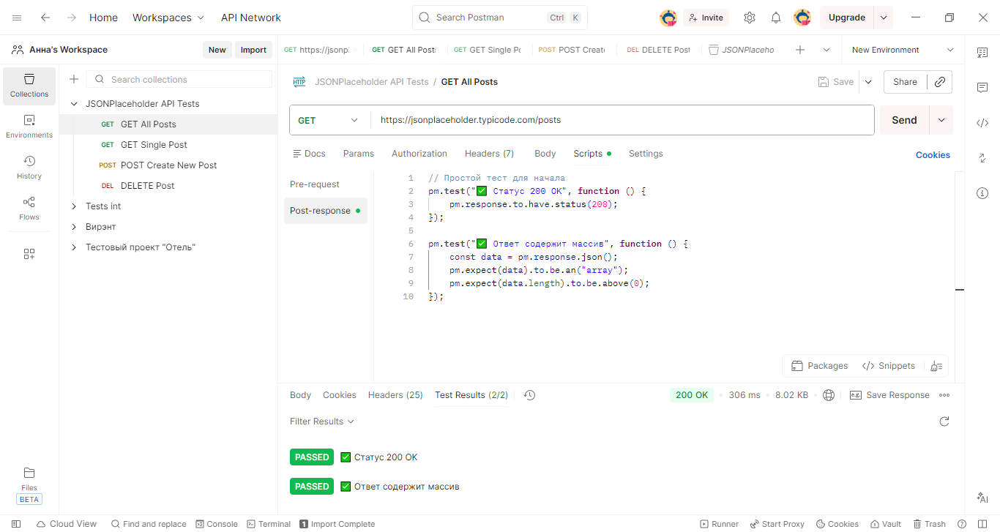

# Тестирование API с помощью Postman

## Описание проекта
В этом проекте я протестировала публичное API JSONPlaceholder с использованием Postman. Были созданы автоматические тесты для проверки статусов ответов, структуры данных и их валидации.

## Используемые технологии
- Postman
- JavaScript (для написания тестов)
- REST API
- JSON

## Тестируемые endpoints

### 1. GET /posts
- Получение списка всех постов
- Проверки:
  - Статус ответа: 200 OK
  - Ответ является массивом
  - Каждый пост содержит поля: userId, id, title, body

### 2. GET /posts/1
- Получение конкретного поста по ID
- Проверки:
  - Статус ответа: 200 OK
  - Наличие всех обязательных полей
  - Типы данных соответствуют ожидаемым
  - Значение id равно 1

### 3. POST /posts 
- Создание нового поста
- Проверки:
  - Статус ответа: 201 Created
  - Созданный объект содержит переданные данные
  - Присвоен новый id

## Скриншоты

### 1. Структура коллекции

## Что я проверила в тестах
- ✓ Коды ответов (200, 201)
- ✓ Структуру JSON-ответов
- ✓ Типы данных полей
- ✓ Наличие обязательных полей
- ✓ Соответствие отправленных и полученных данных

## Выводы
API JSONPlaceholder работает корректно. Автоматические тесты в Postman позволяют быстро проверять функциональность endpoints и валидировать данные.