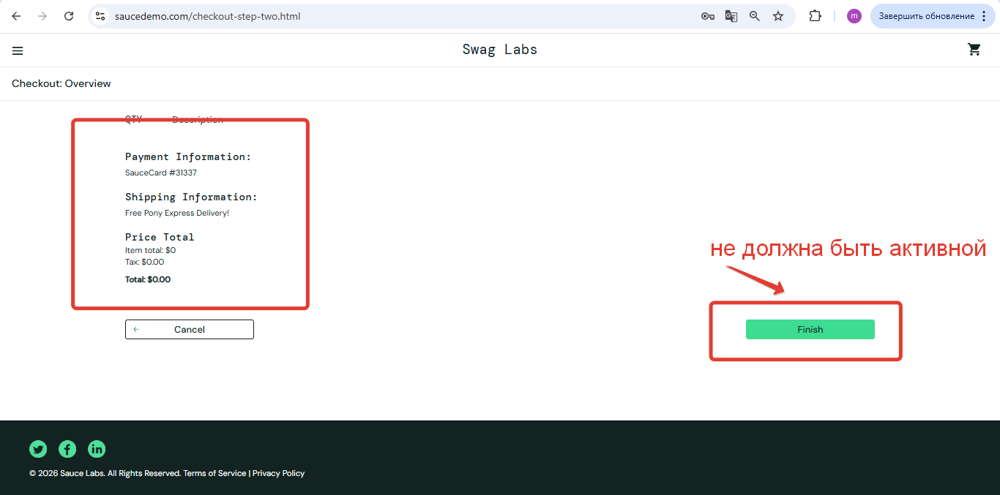

# Баг-репорт: Возможность оформления заказа с пустой корзиной

ID: BUG-002  
Проект: SauceDemo  
Модуль: Корзина → Оформление заказа  
Дата: 10.11.2025  
Автор: Анна 
Приоритет: Критический  
Серьезность: Блокирующая  

---

## Описание
Система позволяет перейти к оформлению заказа и заполнить данные доставки при пустой корзине. Это нарушает базовую бизнес-логику e-commerce.

## Шаги воспроизведения
1. Авторизоваться как standard_user / secret_sauce
2. НЕ добавлять товары в корзину (корзина пустая)
3. Нажать на иконку корзины в правом верхнем углу
4. На странице корзины нажать кнопку "CHECKOUT"
5. Заполнить форму оформления заказа любыми данными
6. Нажать "CONTINUE" → "FINISH"

## Скриншоты
### 1. Пустая корзина с активной кнопкой CHECKOUT

### 2. Успешное оформление без товаров

## Фактический результат
- Можно перейти к оформлению заказа с пустой корзиной
- Система позволяет заполнить все данные доставки
- Заказ "успешно оформляется" без товаров
- Пользователь получает подтверждение заказа

## Ожидаемый результат
- При пустой корзине кнопка "CHECKOUT" должна быть неактивна
- Или при нажатии должно быть сообщение: "Добавьте товары в корзину для оформления заказа"
- Система не должна позволять оформлять заказы без товаров

## Окружение
Windows 11
- Браузеры: 
Chrome 142.0, 
Firefox 147.0, 
Edge 144.0

Mac iOS
Safari 18.6

---

Статус: Открыт  

